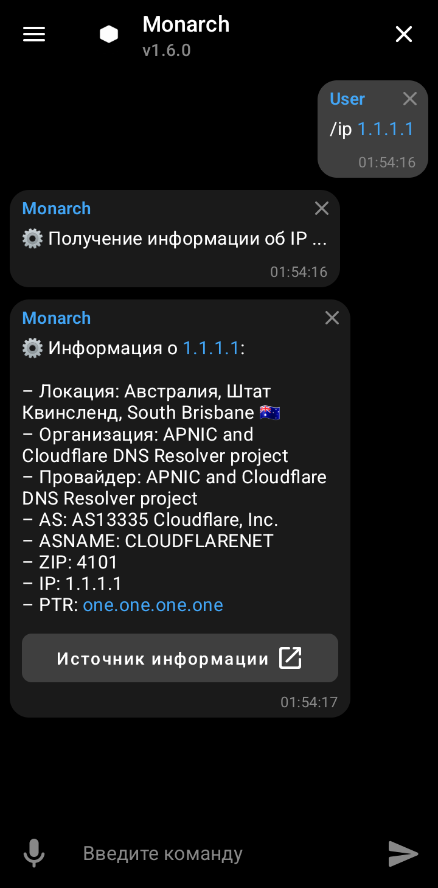
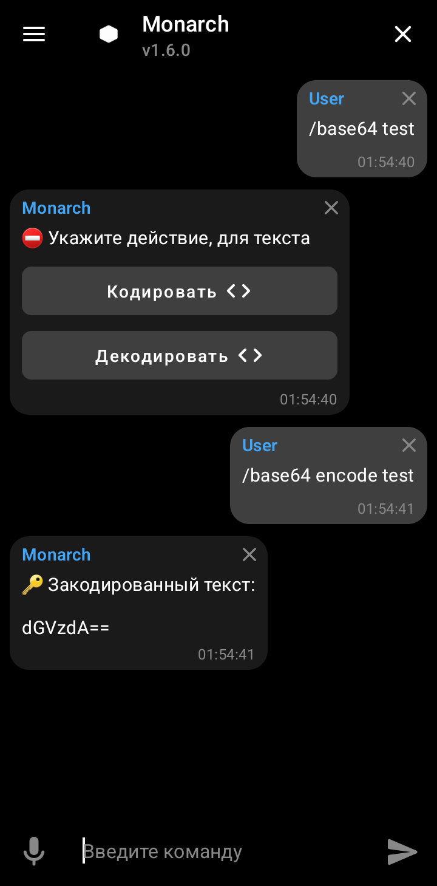
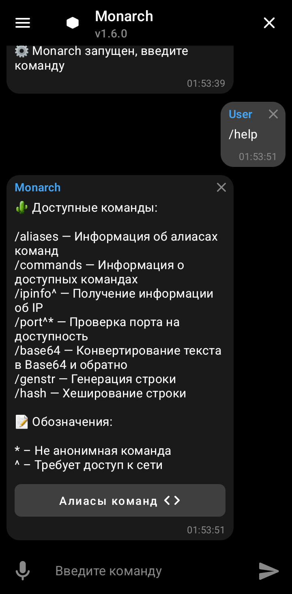

# Monarch <sup>*beta*</sup> 


> Многофункциональный ассистент

## Описание

__Monarch__ (*mon*olithic *arch*itecture) — Мобильный ассистент с командным интерфейсом
реализованным в виде чата для выполнения различных задач, построенный на основе
[Jetpack Compose](https://developer.android.com/jetpack/compose).

Проект состоит из трёх компонентов:

1. [App](app/src/main/kotlin/net/monarch/app) - пользовательский интерфейс.
2. [Core](core/src/main/kotlin/net/monarch/core) - функциональная часть (внутренняя логика).
3. [Commands](commands) - модули команд.

## Функционал

> **Примечание**
>
> Встроенный голосовой ввод на данный момент не работает, вводить команды голосом можно используя
> клавиатуру, которая такое поддерживает.

Реализованные команды:

- Базовые *(base)*:
  - `commands` - Список доступных команд.
  - `triggers` - Список триггеров для команд.
- Шифрование *(crypt)*:
  - `base64` - Конвертация текста в Base64 и обратно.
  - `hash` - Хеширование строки через разные алгоритмы (SHA-512, SHA-384, SHA-256, SHA-1, MD5).
- Сеть *(network)*:
  - `ipinfo` - Получение информации об IP.
  - `port` - Проверка доступности порта.
- Социальные *(social)*:
  - `currency` - Курс валют относительно рубля (по данным ЦБР) 
- Текст *(text)*:
  - `genstr` - Генерация строки из случайных символов.

## Скриншоты

<p align="center">
  
  
  
</p>

## Зависимости

- Android 10
- JDK 11 *(только для сборки).*
- Gradle 7.5 *(только для сборки).*
- Git 2.37 *(только для сборки).*

*Дополнительные зависимости указаны в [`app/build.gradle.kts`](app/build.gradle.kts) и 
[`build.gradle.kts`](build.gradle.kts).*

## Установка

Сборка production релиза:

```shell
$ ./gradlew clean assembleRelease
```

Установка (через ADB):

```shell
$ adb install app/build/outputs/apk/release/app-release.apk
```

## Лицензия

Copyright © 2022 [Node](https://github/TheNodeOrg).

Проект распространяется под лицензией [Apache License 2.0](license).
